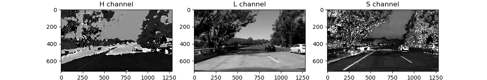

**Advanced Lane Finding Project**

The goals / steps of this project are the following:

* Compute the camera calibration matrix and distortion coefficients given a set of chessboard images.
* Apply a distortion correction to raw images.
* Use color transforms, gradients, etc., to create a thresholded binary image.
* Apply a perspective transform to rectify binary image ("birds-eye view").
* Detect lane pixels and fit to find the lane boundary.
* Determine the curvature of the lane and vehicle position with respect to center.
* Warp the detected lane boundaries back onto the original image.
* Output visual display of the lane boundaries and numerical estimation of lane curvature and vehicle position.

[//]: # (Image References)

[image1]: ./examples/undistort_output.png "Undistorted"
[image2]: ./test_images/test1.jpg "Road Transformed"
[image3]: ./examples/binary_combo_example.jpg "Binary Example"
[image4]: ./examples/warped_straight_lines.jpg "Warp Example"
[image5]: ./examples/color_fit_lines.jpg "Fit Visual"
[image6]: ./examples/example_output.jpg "Output"
[video1]: ./project_video.mp4 "Video"

## [Rubric](https://review.udacity.com/#!/rubrics/571/view) Points

### Here I will consider the rubric points individually and describe how I addressed each point in my implementation.  

### Camera Calibration

Before using images from the camera, we should remove radial and tangential distortions. In order to do this, we first need to calibrate our camera. I'm using 20 given photos of chessboard calibration pattern.

For any given pattern photo we need to find all chessboard corners on that image. Having enough (img_points, obj_points) sets we can use `cv2.calibrateCamera()` function to calibrate camera and get camera's intrinsic parameters which can be used to undistort images. With the given calibration images set reprojection error is about 0.15 which is good enough for our goals.

After camera calibration we can store all intrinsic parameters to YAML file to use them whenever we want without calibration.

Here's the example of undistorted image:


### Pipeline (single images)

All pipeline steps will be shown for this arbitrary project video frame:


#### 1. Distortion correction

Using camera's intrinsic parameters we can undistor any image which was taken with this camera. Example of undistorted image:


Next two steps of my pipeline are done inside of `ImagePreprocessor` class. 

#### 2. Getting thresholded binary image

First, we need to get a combination of four gradient thresholds:

* Gradient absolute value for each image axis (`gradx` and `grady`)
* Gradient magnitude (`mag_binary`)
* Gradient direction (`dir_binary`)


After combining these four images using formula `(gradx == 1) & (grady == 1) | (mag_binary == 1) & (dir_binary == 1)` we get this threshold image:


Before applying the set of color thresholds we need to convert our image to HLS color space since this color space provides well differed white and yellow colors in S and L channels. On the image below we can those channels:



Combining L and S channel threshold is necessary mainly for proper lane detection in areas with low contrast between lane and background. Here's the resulting binary images:


I combine those images using formula `(color_thresh_s == 1) & (color_thresh_l == 1)`. 

Now we can apply merge all binary images we have into one using simple formula `(color_thresh == 1) | (combined_grad_thresh == 1)`:


#### 3. Perspective transform

In order to get source points for perspective transform I've just pin pointed four points on a image of straight lane where first two and second two points lie on their own horizontal lines. To get destination points I've just stretched that trapezoid to a rectangle.

| Source        | Destination   | 
|:-------------:|:-------------:| 
| 558, 480     	| 305, 120      | 
| 735, 480      | 1022, 120     |
| 279, 669      | 279, 669      |
| 1048, 669     | 1048, 669     |

Image, transformed to the bird view:


All line fitting stuff happens in `SlidingWindowScanner` class.

#### 4. Fitting the line

The first frame, that comes to this pipeline is used for initialization. It is necessary to get the first approximation of line position. I used sliding window scanner to achieve this. First, I get the histogram of the lower half of an image and find two biggest peaks on it using `scipy.signal.argrelextrema()` function. Before getting maximums I smooth histogram with Gaussian filter and use threshold to reset all values, lower that the scaled average value of histogram to zero:


The positions of those peaks allow us to place the first pair of scanning windows in the areas of lines which are being searched. Other windows are being placed to the same places as their predecessors, shifting to the mass center of surrounding points. After that we can get all good points and fit our lines:


Having initial window posiotions we don't need to do a blind search in next frames. We just need to search in +- window width area near the line:


To achieve the smoothness of lane detection I use the averaging of line coefficients between 5 subsequent frames.

#### 5. Radius of curvature and car position estimating

Having line coefficients we can rescale it to the world coordinates using known dimentions (for example, the approximate lane width). 

```
coeffs = np.polyfit(y * ym_per_pix, x * xm_per_pix, 2)
radius = ((1 + (2 * coeffs[0] * y_val * ym_per_pix + coeffs[1]) ** 2) ** 1.5) / np.absolute(2 * coeffs[0])
```
Given code snippet allow us to calculate the radius.

In order to estimate the car position relatively to the lane center we just calculate distances to the left and right lane markings and translate them to the distance from the lane center.

#### 6. Putting it all together

Function `process_image()` of `SlidingWindowScanner` class outputs several data layers and radiuses of curvature for left and right lane markings. No we can construct the resulting output frame:

 

---

### Pipeline (video)

Final version of the annotated video you can find (here)[https://github.com/grygoryant/CarND-Advanced-Lane-Lines/blob/master/project_video_annotated.mp4]

---

### Discussion

It is obvious that this solution is not the production solution which can be used in real self-driving car. Before going to production it is necessary to increase the robustness of proposed algorithm and to generalize it to make it possible to use it on roads with different width of lanes, in different weather and lighting conditions and, what's more, driving uphill or downhill. 

